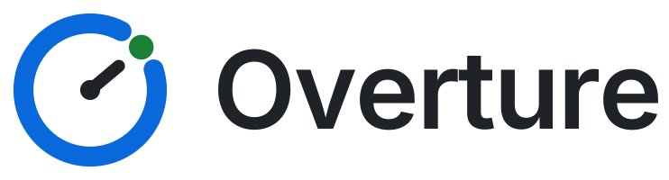
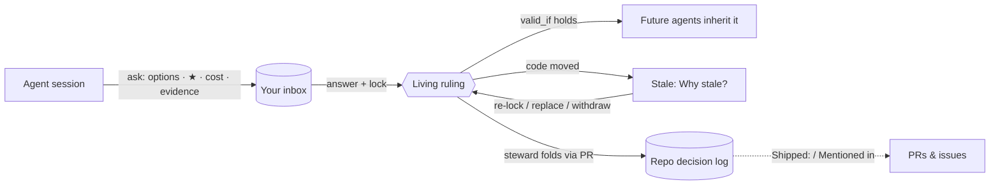

<h1 align="center">
  <picture>
    <source media="(prefers-color-scheme: dark)" srcset="docs/brand/overture-logo-dark.svg">
    
  </picture>
</h1>

<p align="center">
  <strong>The decision layer for AI software development.</strong><br>
  Your agents ask. You rule. Your rulings stay honest as the code moves.
</p>

<p align="center">
  
  
  
  
  
</p>

---

## Why Overture exists

AI agents now write much of the code. Two things have become scarce:

- **the owner's attention**, and
- **a reliable record of why the code is the way it is.**

An agent that has to stop and ask has two bad choices today. It can block the
terminal with a prompt that disappears when the session ends. Or it can guess,
and the guess becomes architecture nobody chose.

Overture is a Claude Code plugin plus a small self-hosted server. Together they
turn every one of those moments into a **ruling**:

1. **An agent asks a structured question.** It gives options, a recommended
   pick (★) with who recommended it, what each option costs, and evidence that
   cites `path:lines` in the repository.
2. **You answer from any browser**, behind your own Cloudflare Access. You can
   answer one at a time, or as a keyboard-driven round: `1`–`9` to pick, then
   **Lock all**.
3. **Locking turns the answer into a ruling**: a commitment, in your own words,
   that every later agent session inherits.
4. **The ruling watches the code it rests on.** Each ruling declares what must
   stay true (`valid_if`): a cited excerpt, a file hash, or an item's status.
   When that stops holding, the ruling reads **stale**, and **Why stale?** says
   which check failed. You then re-lock it, replace it, withdraw it, or stop
   checking it, on purpose.
5. **The steward folds rulings into your repository's own decision log.** The
   steward is one named session. The fold goes through a pull request, in your
   git, not a vendor's database.



GitHub reviews **diffs**. Claude Code runs **sessions**. Cloudflare guards the
**door**. Overture holds the **decisions** between them, and checks each one
against the code it rests on.

## Status at a glance (v1.31.0)

| | |
|---|---|
| **Releases** | 85 commits, 0.7.0 → 1.31.0, each documented in [CHANGELOG.md](CHANGELOG.md) |
| **Tests** | 723 test functions across 6 suites: kit 303, server 285, browser 78, onboard 31, build 15, vendor 11 |
| **Server footprint** | Python standard library plus `PyJWT` and `cryptography`. No CDN: Mermaid and Cytoscape are vendored and checksum-verified. |
| **Plugin surface** | 15 skills, 8 committee agents, 4 hook scripts on 3 events, ~40 `agent.py` commands |
| **Latest release** | **1.31 Hardening**: parser-based HTML sanitizer, a per-request CSP nonce, CSRF rotation without a restart, author provenance on backlinks, a GRILL-ORIGIN badge |
| **Operator model** | One owner per console. Many consoles are joined through the Portfolio and the cross-project priority ribbon. |

## Roadmap: lanes, waves and progress

The percentages below are judgement calls from the advisory review in
[docs/STRATEGY.md](docs/STRATEGY.md), not measurements. They estimate how far
each lane has got toward a *category-defining 1.0*: the version a team would
adopt as its default way to supervise AI agents. They are grounded in what the
code does today and what it lacks.

### Lanes

| Lane | Progress | What is done | What comes next |
|---|---|---|---|
| **Core decision engine**: questions, locks, anchors, the fold | `██████████████░░░░░░` **70%** | Typed questions with evidence; Living rulings with excerpt/sha256/status anchors; git-evidenced `reanchor`; append-only owner acts; a two-step reviewed fold; deliberation seats (roar, refine, drill, deliberate) | Symbol/AST anchors next to excerpts; agents check "rulings touching this path" before they edit; rulings as a CI check; ruling search and dependencies across items |
| **Trust & security** | `█████████████░░░░░░░` **65%** | Access JWT on every request, loopback included; the server runs no project code and no git; closed-schema pushes; O_NOFOLLOW atomic writes; sandboxed visuals; nonce CSP; CSRF rotation; per-project tokens | Real release signing (sigstore/minisign); record *who* locked a ruling; a same-UID agent isolation recipe; built-in webhook HMAC; a collaborator-only trust filter on backlinks |
| **Ecosystem & integrations** | `████████░░░░░░░░░░░░` **40%** | GitHub PRs and issues (`prs-push`, `issues-push`); "Shipped:" and "Mentioned in" backlinks; playbooks; webhook and cron triggers; adapters for any decision log | An MCP server so non-Claude agents can ask and query; Linear/Jira adapters; a Slack/email doorbell; ruling-aware PR comments; MADR/ADR adapter templates |
| **Onboarding & distribution** | `███████░░░░░░░░░░░░░` **35%** | Plugin marketplace install; `/overture:console-onboard`; first-run hero; systemd installer; release zip with a deny-list build check | An identity backend other than Cloudflare (Tailscale/OIDC/loopback solo mode); launchd and Docker; a hosted demo console; a 5-minute path with no adapter |
| **Team & multi-operator** | `███░░░░░░░░░░░░░░░░░` **15%** | One server can host many projects; Portfolio; a priority ribbon across consoles; Shift report | Named operators from Access identity; roles (owner/reviewer/observer); two-key locks for high-stakes rulings; routing questions by item or label; handoff reports |
| **Overall, weighted toward the category 1.0** | `█████████░░░░░░░░░░░` **≈ 45%** | | |

### Waves

| Wave | Theme | Goal | Status |
|---|---|---|---|
| **Wave 1, The solo cockpit** (0.7 → 1.31) | One owner commanding many agents across many projects | Questions, Living rulings, the fold, deliberation, playbooks, triggers, Portfolio, the palette, Shift report, hardening | ✅ **100%: shipped** |
| **Wave 2, Rulings that bite** | Solo depth and enforcement | A solo developer installs it in under 10 minutes, and a broken ruling blocks a bad merge. Symbol anchors, a CI Action, ruling lookup before an agent acts, signed releases, Docker/launchd, solo mode without Cloudflare | 🟡 **~15%**: excerpt-first anchors and reanchor are the base |
| **Wave 3, Teams** | Several operators, accountable by name | Every record carries an operator identity; roles, routing, two-key locks, Slack/Linear. The audit trail holds up in a team review or a compliance setting. | 🟠 **~10%**: multi-project server and Portfolio are the base |
| **Wave 4, Protocol** | From product to standard | Publish the question/ruling/`valid_if` format as an open spec, with an MCP reference server and adapters for other agent vendors. Overture becomes the reference implementation of a format others emit. | ⚪ **~5%**: the closed-set schema exists but is not yet published |

## The moat

An advisory board (product strategy, principal engineering, DevOps/SRE,
security, developer-tools market) and a psychology team (cognitive,
organizational, human factors, behavioral science) each reviewed the project.
Their full reports are in [docs/STRATEGY.md](docs/STRATEGY.md). They ranked
three moats:

1. **Living rulings.** A decision that notices when the code under it has
   moved. The hard part to copy is the edge cases already worked out, not the
   idea:
   - excerpts that hold anywhere in a file, ignoring whitespace;
   - refusals for secrets, symlinks and oversized files;
   - re-anchoring only when pushed git history proves the cited lines;
   - refusing whole-file hashes where an excerpt fits;
   - a year of owner rulings on what a stale decision *means*.

   ([`anchors.py`](plugin/kit/overture/anchors.py),
   [`refactor.py`](plugin/kit/overture/refactor.py))
2. **The fold.** A reviewed gate from the console into *your* repository's
   decision log. It is two-step and all-or-nothing, and rerunning it is safe.
   The record of why lives in your git, not a SaaS database. This is the trust
   argument no hosted competitor can make.
   ([`fold.py`](plugin/kit/overture/fold.py))
3. **The decision → outcome thread.** Every PR and issue that names a ruling is
   linked back to it, and the Shift report measures time-to-answer and merged
   PRs per ruling. The mechanism is easy to copy. The history it builds up is
   not.

## Why this changes development

**The thesis.** When agents write most of the code, the valuable artifact is
no longer the diff. It is the **decision** that shaped the diff. Today that
decision is lost in a transient prompt, buried in a growing `CLAUDE.md`, or
never made at all. Overture turns it into a *typed, evidenced, falsifiable
constraint*. Agents must cite it, owners can audit it, and the code itself
checks it.

How it amplifies **an individual developer**:

- **Interruptions become a batch you pull.** The `ask_guard` hook stops
  non-steward sessions from blocking you with `AskUserQuestion` and routes
  their questions to the inbox. You decide on your own schedule, not N agents'
  schedules. Interruption research (Gloria Mark) shows how costly an
  interruption is to recover from. Overture removes that cost by design.
- **System 1 for the routine, System 2 where it matters.** The ★ default and
  the 1–9 keyboard rounds make low-stakes calls fast. The cost shown before
  deliberating (about 100k tokens a seat) makes deep thinking a deliberate
  choice.
- **Calibrated trust, not blind trust.** Research on trust in automation (Lee
  & See; Parasuraman & Riley) says trust should track how reliable a thing
  actually is. A stale flag is exactly that signal: *this* ruling's premise
  just changed, so trust it less until you look.
- **Situation awareness across many agents.** This covers all three of
  Endsley's levels:
  - *perceive*: status chip, active agents, Portfolio tallies;
  - *comprehend*: Status flowchart, Project map, "what's new";
  - *project*: a priority ribbon with traffic-light ages, and a stale count as
    debt that is building up.

How it amplifies **a team**:

- **A shared memory of why.** Every ruling carries the question, the options,
  the costs, the evidence, the owner's own words and forward links to PRs. A
  new teammate learns *why* the code is the way it is from the decision log,
  not by finding the right person to ask. This is a transactive memory system
  (Wegner) that lives in git.
- **Built-in dissent.** Adversarial, security and Roar seats make challenge a
  standing part of the process instead of a social risk (Edmondson,
  psychological safety). Launch Idea's five grill questions run a pre-mortem
  (Klein) before work starts.
- **Less bikeshedding.** Bounded options with a stated cost cap how wide a
  debate can get.
- **Accountability that sharpens thinking.** Locking is a public commitment.
  When people expect to justify a choice, they decide more carefully (Lerner &
  Tetlock).

**How it becomes the standard.** It goes through three stages:

1. **Within one repository**, every lock is a constraint that every future
   session inherits, so the value grows with use.
2. **Across one owner's portfolio**, the priority ribbon pools that owner's
   attention.
3. **Across the industry**, the step is Wave 4: publish the question/ruling/
   `valid_if` format as an open spec, an "ADR for agents" that any agent vendor
   can emit and any console can check. Standards come from formats, not
   products. Overture gives up a proprietary schema and keeps what cannot be
   copied: the engine's judgement and each team's history of rulings.

**What could stop it.** Being honest about the risks is part of the case:

- **Platform risk.** Claude Code or GitHub could ship "agent questions"
  natively. Overture's answer is to be the open format plus the most careful
  engine, so a native feature can adopt the format rather than replace it.
- **Single operator.** Locks record `by: "owner"`, not a person, so teams
  can't use it yet. That is Wave 3.
- **Setup friction.** A Cloudflare account, an Access app, a tunnel and
  systemd keep many developers out. That is Wave 2.
- **Lexical anchors.** A behaviour change that leaves the cited text intact
  never goes stale. Symbol anchors are the next step.
- **Automation bias and question fatigue.** If agents ask too much, owners
  rubber-stamp the ★. Planned mitigations:
  - ★-acceptance rate per recommender in the Shift report;
  - a "blind pick" mode for high-stakes questions;
  - leaving changed-evidence questions out of **Lock all**;
  - reporting withdrawn and replaced rulings next to speed metrics.

---

This README describes the kit as it is today. [CHANGELOG.md](CHANGELOG.md)
says what each release added.

## Install

Two routes. Both end at `/overture:console-onboard`.

### A. Straight from this repository (no download)

In Claude Desktop's **Code** tab or in `claude`:

    /plugin marketplace add MikeHeid/overture
    /plugin install overture@overture

Then, in your project:

    /overture:console-onboard

Updates land with:

    /plugin marketplace update overture
    /plugin update overture@overture

### B. From a release zip

Get **`overture-<version>.zip`** from
[Releases](https://github.com/MikeHeid/overture/releases). Unzip it
somewhere it can stay (it makes a `overture/` folder). Then:

    /plugin marketplace add ~/overture
    /plugin install overture@overture-local
    /overture:console-onboard

Updates: delete `~/overture/`, unzip the new release zip in its place,
then:

    /plugin marketplace update overture-local
    /plugin update overture@overture-local

A one-liner for scripts, including other Claude sessions:

    rm -rf ~/overture && \
      gh release download --repo MikeHeid/overture --pattern 'overture-*.zip' \
        --dir /tmp --clobber && \
      unzip -q /tmp/overture-*.zip -d ~ && rm /tmp/overture-*.zip

Then run the two `/plugin` commands above and restart the session.

### Upgrade the agent server on each onboarded project

Updating the plugin only refreshes the files on disk; the running Python
server does not pick them up until it restarts. For every project that was
onboarded, run the installer with `--start` to copy the fresh kit to
`~/.local/share/overture/kit/` and restart the systemd user units:

    bash ~/overture/plugins/overture/kit/deploy/install.sh \
      --project <path to project> --start

(When using route A, the path is the plugin cache instead; the install
script's path is printed by `onboard.py show` on the project.)

After the restart, verify from the project's machine:

    curl -s http://127.0.0.1:$(grep ^CONSOLE_PORT .overture/console.env | cut -d= -f2)/health
    # → {"ok": true, "version": "<the version you just installed>", ...}

The first Claude session in each project after the upgrade prints a short
banner naming the new version and the commands most useful at that moment
(`items-push`, `items-watch`, `scaffold-dashboard`, `sync-dashboard`,
`page-snapshot`, `prs-push`, `inbox`).

| Guide | For |
|---|---|
| [docs/USER-GUIDE.md](docs/USER-GUIDE.md) | Start here: what the console is, the pinned install, your day and the agents' day, and tips for spending fewer tokens. |
| [INSTALL.md](INSTALL.md) | Installing the plugin and onboarding a project. |
| [docs/MIGRATION.md](docs/MIGRATION.md) | Upgrading. Covers moving a vendored kit onto one pinned install, and the one-off steps each release needs. |
| [docs/CLOUDFLARE.md](plugin/kit/docs/CLOUDFLARE.md) | The Access application, the tunnel and DNS. |
| [docs/ADAPTER.md](plugin/kit/docs/ADAPTER.md) | Connecting the console to your project's work items and decision log. |
| [docs/DEPLOY.md](plugin/kit/docs/DEPLOY.md) | Installing, upgrading and rolling back the systemd services. |
| [docs/RUNBOOK.md](plugin/kit/docs/RUNBOOK.md) | Symptoms, checks and fixes, starting with the loopback `/health` check. |

## Name the session, bootstrap the dashboard

**Set the agent id for a Claude session** — type this in Claude Code:

    /overture:as my-agent-name

The name is recorded against this session in `STATE/sessions.jsonl`. Every
`agent.py` call the session makes signs with it, questions and messages are
attributed to it, and the SessionStart banner knows which session is which.
`OVERTURE_AGENT=my-agent-name` in the shell env is a machine-wide fallback;
`/overture:as` wins for that session.

**Bootstrap the dashboard** — in a terminal on the project's machine:

    # Writes docs/console/page.html with Header / Items / Rollout / Engine / Spec
    # sections and injects a matching board() into .overture/adapter.py.
    agent.py --state <STATE> scaffold-dashboard --project .

    # Insert a <details data-ck-item="X"> stub for every item not yet on the
    # page, nested under its parent. Idempotent; hand-edits inside each node
    # survive re-syncs.
    agent.py --state <STATE> items-push --adapter .overture/adapter.py \
      --sync-dashboard docs/console/page.html

    # Commit, snapshot, press "Use this page" in the console.
    git add -A && git commit -m "dashboard: scaffold + sync"
    agent.py --state <STATE> page-snapshot --path docs/console/page.html

    # Keep the live values fresh:
    agent.py --state <STATE> items-watch --adapter .overture/adapter.py

**Make it more beautiful.** The console inherits CSS custom properties from the
host page's `:root`. Define any of these to re-skin the whole kit (an unlayered
host `:root` beats the kit's `@layer console-fallbacks`):

    :root {
      --c-bg: #...;  --c-surface: #...;  --c-surface-alt: #...;
      --c-fg: #...;  --c-fg-muted: #...;
      --c-border: #...;  --c-border-light: #...;
      --c-accent: #...;  --c-accent-fg: #...;
      --c-open: #...;    --c-open-bg: #...;
      --c-claimed: #...; --c-claimed-bg: #...;
      --c-built: #...;   --c-built-bg: #...;
      --c-blocked: #...; --c-blocked-bg: #...;
      --c-deferred: #...; --c-deferred-bg: #...;
      --radius-sm: 6px;  --radius-md: 10px;
    }
    @media (prefers-color-scheme: dark) { :root:not([data-theme="light"]) { ... } }

The 0.9.11 fallback palette is Primer-aligned (`#0969da` accent on light,
`#58a6ff` on dark) and ships `color-scheme` so native scrollbars match. Then:

- Add deep links from the item view to your dashboard by setting
  `sections` in `.overture.json`:
  `{"sections": {"AB-2": ["#features/rollout", "#features/timeline"]}}`.
  The item view renders chips linking to each anchor.
- Add in-place state badges by marking any `<section data-ck-item="X">`
  on the dashboard. The console injects a `"X ◐ 2 ◑ 1 ◌ 3 ○ 4"` badge
  in-place, updated on every live wake; clicking it opens the panel on X.

## Hooks the plugin ships (doorbell + command guards)

The plugin runs three hooks in every Claude session on your machine. All three
act only in projects that `agent.py register` has entered in your user-level
registry (`~/.config/overture/projects.json`); in any other project they
print nothing and exit 0.

| Hook event | File | What it does |
|---|---|---|
| `SessionStart` (startup/resume/clear/compact/fork) | `plugin/hooks/session_start.py` | Reads the doorbell for this project's console and prints what the owner sent while no session was watching: questions, process requests, chat replies, scan requests, visual requests, each with its seq and the command to handle it. On first run after an install or an upgrade, prints a banner naming the running kit version and the commands most useful at that moment. |
| `UserPromptSubmit` | `plugin/hooks/name_session.py` | Picks up `/overture:as NAME` and records the mapping `session_id → agent name` in `STATE/sessions.jsonl` (atomic rewrite). The next `agent.py` call reads the name from this file. |
| `PreToolUse` (matcher: `AskUserQuestion`) | `plugin/hooks/ask_guard.py` | On a non-steward session in a project that names a steward, refuses `AskUserQuestion` so the question goes to the owner through the console instead of a transient prompt. |

All three are stdlib-only, read-only outside their known files, and never run
anything from the repository. See the module docstrings for the trust model.

## What you can do

### Answer, lock, and ask for a round

- **Answer and lock.** Each question shows its options, the ★ and whose
  recommendation it is, and evidence rows. The evidence shows the cited lines
  as they are now, and says whether they changed since the question was asked.
  Your own words on an answer travel with it. Locking turns an answer into a
  ruling. A round's questions open as one form: ←/→ to move, 1–9 to pick, then
  **Lock all & process**.
- **Lock with one tap.** **Lock this answer** sends the lock immediately
  (0.9.12). If the server refuses it (e.g. a condition is no longer true),
  the question card shows the reason and the Lock button comes back.
- **A round moves on by itself.** Pick a single-choice option and, after a
  moment, the form moves to the next question still without a pick, and says
  so. It stays put for multiple choice, for a question you are writing words
  on, and for ↑/↓ through the options. It never moves onto the Lock page.
- **Answer these together.** Loose questions on one item, asked by one named
  agent session within five minutes of each other, are grouped in the inbox
  and open as one form. Unnamed sessions are never grouped, because nothing
  shows they are one agent's.
- **Send to agent.** Once you have answered something, a bar under the panel
  header shows "N answered · M left" and sends the agent the same "process
  them" signal as before. It goes once sent and comes back with the next
  answer.
- **Locked questions roll up** to one line (question, pick, state). Click or
  press Enter to open one. Open and stale questions stay whole. The slides and
  fades run only when your system does not ask for reduced motion.
- **Deliberate before answering.** On an open question, pick one to three
  seats (DevOps, UX, adversarial, security, architect, analyst, or one you
  name). They reply with a ★ and their reasons, and never answer or lock for
  you. The cost is shown first, at about 100k tokens a seat.
- **Next step ▾** beside every locked answer:
  - **Follow up**: chosen seats look at that answer again.
  - **Roar**: a three-round panel, at most once per lock.
  - **Refine** or **Drill**: runs the skill your project names, by default
    the plugin's own `overture:refine` and `overture:drill`.

  Each step comes back as questions for you to lock. Nothing is written into
  the project before you lock.
- **Status flowchart on every item.** Each item view carries a collapsible
  **Status flowchart** that the server builds from your questions and rounds:
  the item at the left, open/stale/locked questions coloured, rounds as their
  own shape, dotted edges where a newer question supersedes an older one or
  a round follows up on an earlier one. It is lazy (nothing loads until you
  expand it) and renders inside the same sandboxed Mermaid frame as a
  requested visual. **Click a node** to jump straight to that question's card
  (or open an item if it is an item node).
- **Project map** at the top of the Inbox: a tree of every item, parent to
  child, each node coloured by its own questions' roll-up (open > stale >
  answered-but-unlocked > locked) with a short tally. Click an item to open
  it. A chip row narrows the map to one state; ancestors stay drawn muted so
  the tree is still a tree. Lazy, like the per-item chart.
- **Save SVG** on every chart and Mermaid visual. The rendered SVG is sent
  back to the parent and downloaded as a plain file; nothing goes back to
  the server.
- **Request a visual** on an item. The agent answers with a Mermaid diagram
  (rendered right there inside a sandboxed frame — the vendored lib runs in an
  opaque origin and cannot touch the console's cookies, storage or network;
  **View source** still shows the raw `.mmd`), or with an HTML mock shown the
  same way, scripts off entirely.
- **A short chime when a visual arrives**, the drawn item surfaces at the top
  of the Inbox under **New visuals**, and the Feed row says "Visual drawn".
  The badge on the inbox button and the Feed tab counts it too, until you look.
- **Star what matters.** Tap ☆ on a visual or an item (the item view's title
  bar, the Inbox row, the New visuals row). The **Favorite** tab lists them,
  grouped by item, newest first. Only the owner can star.
- **Chat**, for a message not tied to a question. It wakes the watching
  session.

### Keep rulings honest as the code moves

A question says what must stay true for its answer to stand (`valid_if`):
cited text (an `excerpt`), a whole file (`file_sha256`), or an item's status.
When that stops holding, the answer reads **stale** and **Why stale?** says
which check failed.

- **Still holds: re-lock…** keeps your answer and re-checks it against the
  files as they are now.
- **`agent.py reanchor`** (the steward runs it, `--dry-run` first) turns a
  stale whole-file hash into an excerpt only with evidence: the question names
  a line range in that file, the steward's pushed history holds the version
  it was locked against, and those lines are still in the file exactly once.
  Anything else stays stale, with the reason listed.
- **Withdraw…**: the ruling no longer applies, and you give a reason.
- **Keep, stop checking…**: the ruling stands, but is no longer checked
  against the files.
- **Confirm a proposed anchor.** The steward proposes new lines for the
  ruling to rest on, the server reads them itself, and nothing changes until
  you press Confirm.
- **Replace.** A new question is linked to the stale one. The old ruling
  stands until you lock the new answer.

Only the owner can do any of these, and only on a stale answer. Nothing is
deleted: each act is recorded in a file beside the store, and the fold records the
outcome in your project. New questions are refused a whole-file hash where an
excerpt fits, which is what made most rulings go stale.

### Your dashboard, published by you

The console can sit inside your project's own dashboard page. An agent
stages a page from a merged commit (`agent.py page-snapshot`). The console
then shows it as a proposal, with its ref, commit, size and a sandboxed
preview. It is served only after you press **Use this page**. No agent can
publish, and the "reviewed" label is shown as the agent's claim, because the
server cannot check it.

### See what's happening

- The page updates itself, with no reload. A box you're typing in is never
  redrawn under you.
- The **Inbox** shows what waits for you, with an unread count. The **Feed**
  shows every question, answer, lock and reply, newest first.
- The status bar says whether an agent session is listening right now.
  Optionally, a footer shows your Claude usage for the 5-hour and 7-day
  windows.
- **Several agents, one console.** Sessions can be named (`/overture:as
  agent-6`). One of them, the **steward**, named in your own registry, is the
  only one that processes your requests and folds your answers. The others
  post their questions to your inbox instead of asking you directly.
- The **PRs** tab lists the project's open pull requests, then those
  merged or closed in the last 30 days (`--days` changes it), with checks, draft and merged
  badges, a link to each on GitHub, and an **Open** button for any item or
  question a title or branch names. The steward pushes the list
  (`agent.py prs-push`), and the tab says when it last did.
- The **Favorite** tab lists everything you starred, grouped by item.
- **Cross-project priority ribbon.** The Inbox opens with up to six of the
  oldest awaiting questions across every console (self + each portfolio
  peer), each with a traffic-light dot (yellow < 1h, orange < 24h,
  red > 24h). Click a row to jump — local items open their panel; peer
  rows open the peer in a new tab.
- **Command palette.** Press **Ctrl+K** / **Cmd+K** on any page to open a
  search box over items, questions, playbooks, peers, tabs and actions.
  Type a few characters, press Enter: jumps to an item, runs a playbook,
  opens a peer in a new tab, or hops a tab.
- **Keyboard shortcuts.** Press `?` on any page for the full list.
  `g i / f / p / s / o / c` hop to the Inbox / Feed / PRs / Favorite /
  Portfolio / Chat tab, `g b` closes the panel, `.` focuses the
  Delegate bar, `j / k` walk the rows, Enter / Space opens the focused
  row. Shortcuts never fire in a text input.
- The **Portfolio** tab lists every other console you have configured, with
  its state tallies (`?you ~unl !stale ○lock`), last-activity and a click
  that opens it in a new tab. A bell button opts in to desktop
  notifications so a sibling's new `?you` or `!stale` reaches you even
  when the tab is in the background; a Snooze button sets a 1-hour DND
  lid. Peers are declared in `.overture/portfolio.json`; the Cloudflare
  Access service-token secrets live in `STATE/portfolio-secrets/<peer>.json`
  (`agent.py portfolio-token` prints the layout). The home server does the
  cross-origin calls, so the browser never sees a peer's secret.
- A **Back** control sits at the top of every item view, so **discuss** from
  the dashboard always has a one-tap way home.
- **Direction stays visible.** Each item in the Inbox carries a collapsible
  "N answered on this item" under its open questions, showing the last few
  locked rulings on it. Items whose questions are all locked within the last
  day stay on the list under **Recently answered**, so you can see what was
  asked and what you answered without leaving the Inbox.

## How it fits together

```
 browser ──Access login──▶ Cloudflare ──tunnel──▶ 127.0.0.1:PORT  server.py
                                                     │ checks the Access JWT (team keys + AUD)
                                                     ▼
                                              state dir: store + doorbell
                                                     ▲
 Claude session ── SessionStart hook reads the doorbell (registered projects only)
                └─ skills: console-process / console-fork / console-fold / console-ask / console-visual ── agent.py
```

- **`server.py`** serves the console, inside your published dashboard page if
  you have one. Every request without a valid Access token is refused, loopback
  included. **It runs no project code and no git.** Your work items arrive by
  `agent.py items-push`, git history by `agent.py history-push`, pull
  requests by `agent.py prs-push` (`gh` runs in the steward, never in the
  server), and the page by `agent.py page-snapshot`. The steward runs all
  four in its own process,
  and each sends data the server checks against a closed schema.
- **`agent.py`** is the agent's side. Its commands:

  | Purpose | Commands |
  |---|---|
  | Reading | `inbox`, `todo`, `view`, `answers` (capped at 64 KiB, with a narrower command named when a read is too big), `health` |
  | Asking and answering | `ask`, `reply`, `working`, `synced`, `watch` |
  | Deliberation | `fork-context`, `transcript`, `visual`, `visual-export`, `next-step`, `costs` |
  | Stale answers | `check`, `reanchor`, `propose-anchor` |
  | Pushing data | `items-push`, `history-push`, `prs-push`, `page-snapshot` |
  | Owner only | `register`, `steward`, `server add`, `server token rotate` |

  `--as NAME` names the session.
- **`fold.py`** writes locked answers, and what became of them, into your
  project through its adapter, in the steward's process.
- **`plugin/`** holds the Claude Code plugin: the hook, the skills, and the
  committee agents. Its skills include `roar`, `refine`, `drill` and
  `deliberate`, which a console round uses and which also run on their own
  (`/overture:roar` and so on).
- **`onboard.py`** and **`deploy/`** onboard a project and install the
  services.

### What a project token protects

One console server can host several projects. Each project's agents reach it
with that project's own token. The token is kept in
`~/.config/overture/tokens/NAME` (mode 0600, outside every repository);
`server.json` holds only its hash. `agent.py` picks the project from the
directory it runs in. `agent.py server token rotate NAME` (which you run)
refuses the old token from the next request.

- **What it stops:** cross-talk and mistakes. A wrong `--state`, a skill bug,
  or an agent carrying another project's habits cannot read or write another
  project's console through the kit.
- **What it does not stop:** an agent running as the same OS user that sets
  out to cross over. It can read `tokens/` and the state directories directly.
  Real isolation needs a sandbox or a separate user.
- **An old per-project server is a way around it.** While one still listens on
  `STATE/agent.sock`, that socket answers without a token. Stop it before
  relying on the token.

## Windows + WSL2 (optional)

The server, the tunnel and the systemd units are POSIX; a convenient layout
on a Windows host is to run them in WSL2 while a Claude Code session lives on
either side. A few traps worth knowing:

- **CRLF.** `git config core.autocrlf=true` on Windows gives every file in
  the plugin cache CRLF endings. `install.sh` then fails at once
  (`set: pipefail: invalid option name`), and systemd unit files with a `\r`
  silently misbehave. Install the kit from a copy stripped of CR (`sed -i
  's/\r$//'` on each `*.sh`, `*.in`, `*.py`, `*.js`, `*.css`, `*.html`) or
  clone with `core.autocrlf=false`.
- **Default branch.** `page-snapshot --from-ref origin/main` is the default
  and fails on a repository whose default is anything else. Pass
  `--from-ref HEAD --unreviewed` while bootstrapping, or point `--from-ref`
  at your actual branch.
- **Page path.** `onboard.py` defaults the page to `.overture/page.html`,
  which `page-snapshot` refuses (leading dot). Move the page under
  `docs/console/page.html` or similar.
- **Items.** The server never runs your adapter. After onboarding, run
  `agent.py --state STATE items-push --adapter PATH` once (and whenever the
  item list changes); until then `ask` on any item but `PROJECT` is refused.
- **Reaching the server from Windows.** The agent socket lives in WSL and
  Windows cannot open a WSL2 Unix socket. Options: run the agent-side session
  inside WSL (`wsl -e bash` wrapper), or use the one-server HTTP door with a
  project token on loopback.
- **Linger.** Systemd user units stop when WSL shuts down. Run
  `loginctl enable-linger $USER` in WSL; a Windows process that keeps WSL
  alive still helps when nothing else holds it.

## Trust

- The plugin's hook runs in every project you open, but acts only in projects
  listed in `~/.config/overture/projects.json`, which only `agent.py
  register` and `agent.py steward` write. A cloned repository's
  `.overture.json` is never trusted by itself, and cannot name a steward.
- Anything an agent can write — the adapter, `.git/config`, the dashboard file
  in the working tree — is never run or read by the server.
- The kit never opens `~/.cloudflared/cert.pem` or a tunnel credentials file.
  It checks that the file exists, and nothing more.
- Nothing onboarding writes is a secret. The AUD tag and team domain are what
  tokens are *checked against*; no token can be made from them.

## Development

    python3 -m venv .venv && .venv/bin/pip install -r requirements.txt
    .venv/bin/python test_kit.py && .venv/bin/python test_server.py && .venv/bin/python test_onboard.py
    .venv/bin/python test_build.py
    OVERTURE_BROWSER=1 .venv/bin/python test_browser.py   # needs playwright + browsers

Three `test_kit.py` compatibility tests start older released kits, so they
need the `v0.8.7` and `v0.8.8` tags; in a shallow or tag-less clone run
`git fetch --tags` first, or they fail and name the missing tag.

`test_server.py`'s syscall tests need `strace`, and FAIL when it is missing,
so they cannot quietly not run. On a machine without it, set
`OVERTURE_NO_STRACE=1` to skip them, and each is then reported, by name, as
not run.

To build the release zip:

    python3 build_zip.py --deny-file ~/my-deployment-values.txt

It runs `claude plugin validate --strict` on the result. The deny file lists
strings from your own deployment (hostnames, AUD tags, team domain, home
path), and the build refuses if any of them appears in the zip.
